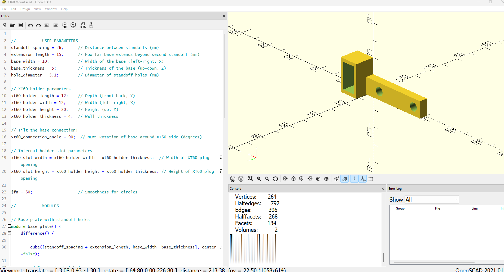

# XT60 Battery Plug Holder for Drone #

This 3D model is a compact XT60 battery connector holder designed for mounting on a drone frame. It consists of two main components:

XT60 Plug Housing – A vertical rectangular enclosure with internal clearance for securely holding an XT60 connector. It includes:

A hollowed center to reduce weight and accommodate the XT60 plug.

A front insertion slot for easy plug access and removal.

Thick side walls (4mm) for structural integrity.

Angled Mounting Base – An extended base plate with two screw holes spaced 26mm apart for attachment to drone standoffs. The base:

Connects to the holder via a user-defined rotation angle (default 90°), allowing custom mounting orientation.

Extends 15mm past the second standoff to provide additional support or alignment flexibility.

The design ensures a snug, durable fit for XT60 connectors while enabling clean integration with existing drone frames using standard M3 hardware. The modular structure allows for parameter adjustments to match specific layout or frame constraints.

